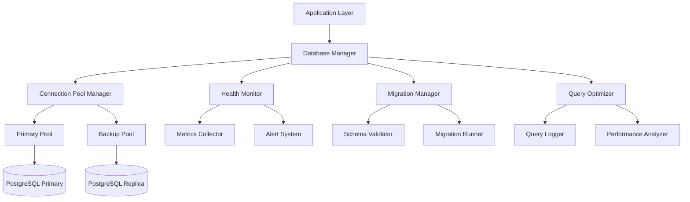

# PostgreSQL Schema Connection Enhancement - Design Document

## Overview

This design enhances the existing PostgreSQL database connection infrastructure to provide robust, reliable, and monitored database operations. The current system has a solid foundation with connection pooling, schema definition, and basic error handling. This enhancement adds advanced connection management, health monitoring, migration capabilities, and comprehensive error handling to ensure production-ready database operations.

## Architecture

### Current Architecture Analysis
The existing system uses:
- **Connection Pool**: Node.js `pg` Pool with basic configuration
- **Schema Management**: Static SQL schema file with initialization scripts
- **Error Handling**: Basic try-catch blocks with console logging
- **Configuration**: Environment-based configuration with validation

### Enhanced Architecture Components



## Components and Interfaces

### 1. Enhanced Database Manager

**Purpose**: Central orchestrator for all database operations with advanced connection management.

**Interface**:
```javascript
class DatabaseManager {
  // Connection management
  async initialize(config)
  async shutdown()
  async getConnection(options = {})
  async releaseConnection(connection)
  
  // Health and monitoring
  async healthCheck()
  getMetrics()
  
  // Transaction management
  async withTransaction(callback)
  async withRetry(operation, options)
}
```

**Key Features**:
- Connection pool management with failover
- Automatic retry with exponential backoff
- Transaction management with rollback capabilities
- Connection health monitoring

### 2. Connection Pool Manager

**Purpose**: Advanced connection pool management with monitoring and failover capabilities.

**Interface**:
```javascript
class ConnectionPoolManager {
  async createPool(config)
  async validatePool()
  async rotateConnections()
  getPoolMetrics()
  async handlePoolError(error)
}
```

**Configuration**:
```javascript
const poolConfig = {
  primary: {
    host: process.env.DATABASE_HOST,
    port: process.env.DATABASE_PORT,
    database: process.env.DATABASE_NAME,
    user: process.env.DATABASE_USER,
    password: process.env.DATABASE_PASSWORD,
    max: 20,
    min: 5,
    idleTimeoutMillis: 30000,
    connectionTimeoutMillis: 5000,
    acquireTimeoutMillis: 60000,
    ssl: { rejectUnauthorized: false }
  },
  backup: {
    // Replica configuration for read operations
  },
  retry: {
    attempts: 3,
    delay: 1000,
    backoffMultiplier: 2
  }
}
```

### 3. Health Monitor

**Purpose**: Continuous monitoring of database connection health and performance metrics.

**Interface**:
```javascript
class HealthMonitor {
  async startMonitoring()
  async stopMonitoring()
  async performHealthCheck()
  getHealthStatus()
  getPerformanceMetrics()
  async alertOnIssues(issue)
}
```

**Metrics Tracked**:
- Connection pool status (active, idle, waiting)
- Query response times
- Error rates
- Connection failures
- Schema integrity checks

### 4. Migration Manager

**Purpose**: Automated schema validation and migration management.

**Interface**:
```javascript
class MigrationManager {
  async validateSchema()
  async runMigrations()
  async rollbackMigration(version)
  async createMigration(name, sql)
  getMigrationHistory()
}
```

**Migration Structure**:
```
backend/database/migrations/
├── 001_initial_schema.sql
├── 002_add_timeline_tables.sql
├── 003_add_indexes.sql
└── migration_history.json
```

### 5. Query Optimizer

**Purpose**: Query performance monitoring and optimization recommendations.

**Interface**:
```javascript
class QueryOptimizer {
  async logQuery(query, duration, params)
  async analyzeSlowQueries()
  async getQueryRecommendations()
  async cancelLongRunningQueries()
}
```

## Data Models

### Enhanced Connection Configuration
```javascript
const connectionConfig = {
  database: {
    primary: {
      host: string,
      port: number,
      database: string,
      user: string,
      password: string,
      ssl: object
    },
    replica: {
      // Read replica configuration
    },
    pool: {
      max: number,
      min: number,
      idleTimeoutMillis: number,
      connectionTimeoutMillis: number,
      acquireTimeoutMillis: number
    },
    retry: {
      attempts: number,
      delay: number,
      backoffMultiplier: number
    },
    monitoring: {
      healthCheckInterval: number,
      slowQueryThreshold: number,
      alertThresholds: object
    }
  }
}
```

### Health Check Response
```javascript
const healthCheckResponse = {
  status: 'healthy' | 'degraded' | 'unhealthy',
  timestamp: Date,
  checks: {
    connectivity: boolean,
    schemaIntegrity: boolean,
    performanceMetrics: {
      avgResponseTime: number,
      errorRate: number,
      connectionPoolStatus: object
    }
  },
  recommendations: string[]
}
```

### Migration Record
```javascript
const migrationRecord = {
  version: string,
  name: string,
  executedAt: Date,
  executionTime: number,
  checksum: string,
  status: 'pending' | 'completed' | 'failed' | 'rolled_back'
}
```

## Error Handling

### Error Classification
1. **Connection Errors**: Network issues, authentication failures
2. **Query Errors**: SQL syntax, constraint violations
3. **Performance Errors**: Timeouts, slow queries
4. **Schema Errors**: Migration failures, integrity issues

### Error Response Structure
```javascript
const errorResponse = {
  error: {
    code: string,
    message: string,
    type: 'connection' | 'query' | 'performance' | 'schema',
    details: object,
    timestamp: Date,
    requestId: string,
    suggestions: string[]
  }
}
```

### Retry Strategy
```javascript
const retryStrategy = {
  maxAttempts: 3,
  baseDelay: 1000,
  maxDelay: 10000,
  backoffMultiplier: 2,
  retryableErrors: [
    'ECONNRESET',
    'ENOTFOUND',
    'ETIMEDOUT',
    'connection terminated'
  ]
}
```

## Testing Strategy

### Unit Tests
- Connection pool management
- Error handling and retry logic
- Migration execution
- Health check functionality
- Query optimization

### Integration Tests
- End-to-end database operations
- Connection failover scenarios
- Migration rollback procedures
- Performance under load

### Performance Tests
- Connection pool stress testing
- Query performance benchmarking
- Memory usage monitoring
- Concurrent connection handling

### Test Structure
```
backend/test/database/
├── unit/
│   ├── connection-pool.test.js
│   ├── health-monitor.test.js
│   ├── migration-manager.test.js
│   └── query-optimizer.test.js
├── integration/
│   ├── database-manager.test.js
│   ├── failover.test.js
│   └── migration.test.js
└── performance/
    ├── connection-stress.test.js
    └── query-performance.test.js
```

## Security Considerations

### Connection Security
- SSL/TLS encryption for all connections
- Certificate validation
- Connection string encryption
- Credential rotation support

### Access Control
- Role-based database access
- Query parameter sanitization
- SQL injection prevention
- Audit logging

### Monitoring Security
- Sensitive data masking in logs
- Secure metric transmission
- Access control for monitoring endpoints

## Performance Optimizations

### Connection Management
- Connection pooling with optimal sizing
- Connection reuse strategies
- Idle connection cleanup
- Load balancing across replicas

### Query Optimization
- Query plan analysis
- Index usage monitoring
- Slow query identification
- Automatic query cancellation

### Monitoring Efficiency
- Asynchronous health checks
- Batched metric collection
- Efficient log aggregation
- Resource usage optimization

## Deployment Considerations

### Environment Configuration
- Development: Single connection pool
- Staging: Primary + replica setup
- Production: Multi-pool with failover

### Monitoring Setup
- Health check endpoints
- Metric collection integration
- Alert configuration
- Dashboard setup

### Migration Strategy
- Blue-green deployment support
- Zero-downtime migrations
- Rollback procedures
- Data consistency checks